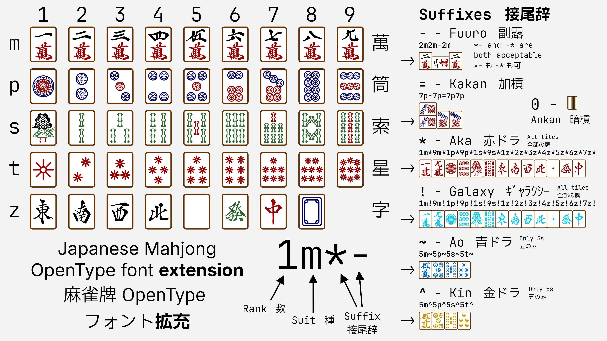

<div align="center">

<h1>Japanese Mahjong Font with OpenType</h1>
<h3>OpenType 機能付き麻雀牌図フォント</h3>



</div>

## OpenType Features

### Ligature (*liga*)

| Software | Support | Note |
|:---|:---:|:---|
| Mainstream Browser|✅ |   |
| Adobe Series | ✅ | |
| iWork (Pages, Numbers, Keynote)|✅|| 
| Office Series|✅| Need to enable manually| 

## Web Tool

### Develop & Build

- Develop

```
npm install
npx parcel src/index.html
```

- Build

```
npx parcel build src/index.html
```

## Special Thanks

- [I.Mahjong - @SyaoranHinata](https://github.com/SyaoranHinata/I.Mahjong/tree/main)
- [Gutenberg Labo](http://gutenberg.osdn.jp)
- [PT Sans Narrow - Google Fonts](https://fonts.google.com/specimen/PT+Sans+Narrow)

## License

This Font Software is licensed under the SIL Open Font License, Version 1.1. 

The license is available with a FAQ at: [https\://openfontlicense.org](https://openfontlicense.org/open-font-license-official-text/)
